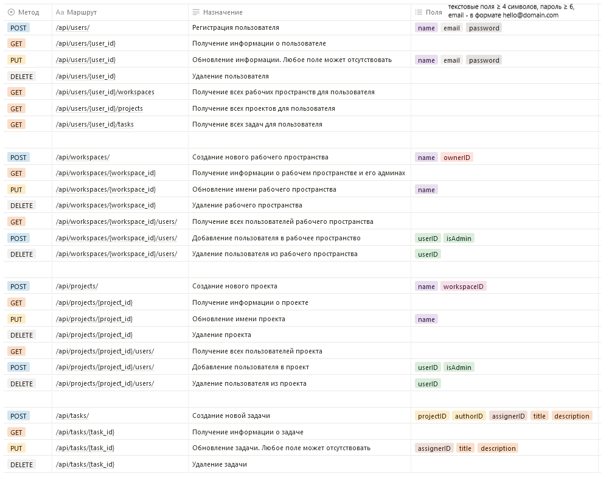

# Task Manager RESTful API

Этот проект представляет собой API без фронтенда (отображаемой части), написанный в рамках учебной
практики по PHP 8.2 с использованием фреймворка Laravel 10.

В проекте реализованы следующие модели: рабочее пространство (workspace), проект (project), пользователь (user)
и задача (task). У каждой модели есть CRUD-контроллер. Также можно добавлять, удалять и выводить связанные модели
(например всех пользователей, прикреплёных к рабочему пространству).

## Маршруты API (API Endpoints)

